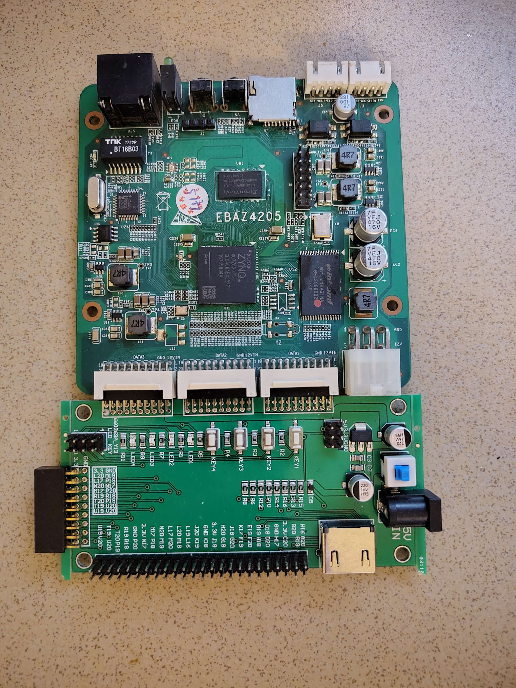
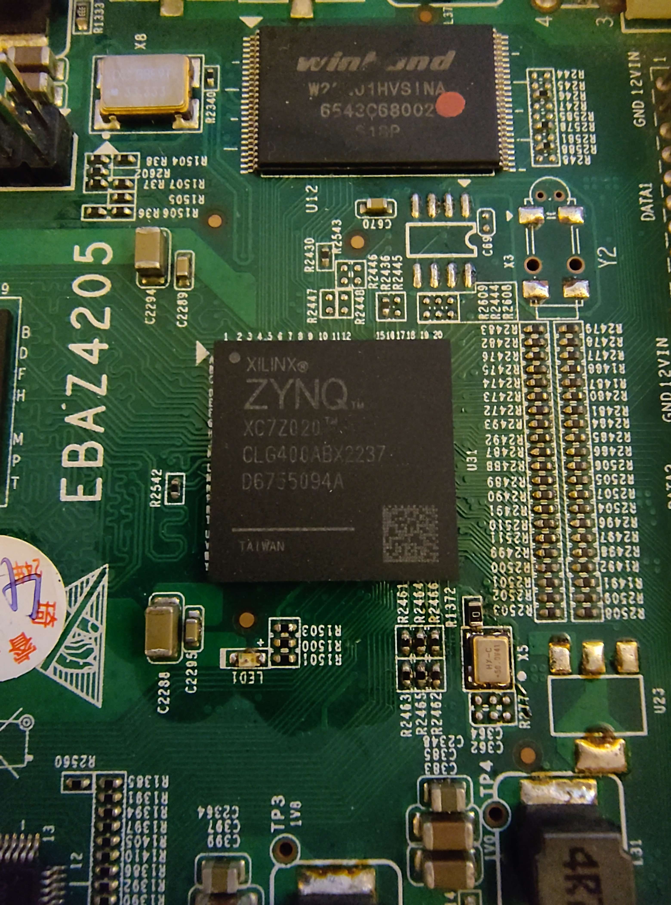
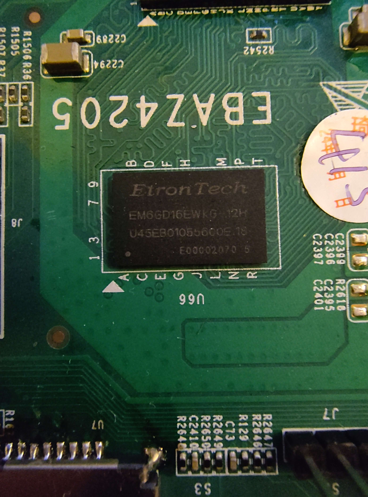

# Mihai's FPGA experiments

## The humble beginnings

I recently became aware of the EBAZ4205 board while browsing [r/FPGA](https://www.reddit.com/r/FPGA/) a while back, and when I found one featuring a Xilinx Zynq 7020 (upgraded from the standard Zynq 7010) on AliExpress I knew I had to get it, especially since the 7020 is about 2.5 times bigger than the 7010.

Admittedly what I found was not the "$5 FPGA board" the forums were calling it, but all in all I managed to score the board, an adaptor board AND a Xilinx JTAG programmer for about 110 EUR, including shipping (the board itself was about 50 EUR, and the adaptor board 15 EUR). I think it is a decent deal, on account of having an upgraded chip, installed JTAG and UART headers, optocouplers, SD card slot, and crystal oscilator. The adaper board has a 5V barrel jack for power delivery, some LEDs (active low it seems), some swiches, an HDMI port, and most of the GPIO supplied to the DATA1-3 ports on the original board.

The Board and the Adapter

The FPGA chip itself

256MB of DDR3 ram. Seems un-upgradeable from looking at some board CAD files

The only real downside to getting this board is that I am now addicted to window shopping AliExpress for random electronics - probably upgrading to proper shopping soon. My bank account hates me in advance.

## Hello Zynq

While my aspiration with this beautiful little board are high (including linux drivers and some matrix multiplication), I thought to start off easy and get some simple combinational logic going. Of course, starting with a simple AND gate following TheOkelo's [Getting Started with the EBAZ4205 as a Zynq-7000 Development Board](https://theokelo.co.ke/getting-starting-with-ebaz4205-zynq-7000/) tutorial.

This thing took me way too long to figure out, between figuring out the pin configurations and the non-orthodox ways this board is wired up, but ultimately I managed to wire some things up myself and get a simple and gate to work. Next step is getting some synchronous logic going, and for that we need to access the on board clock.
